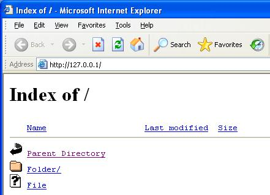



## A Professional Web Server

### Description

YOU MUST TRY THIS NO MATTER WHAT! DON'T LEAVE UNTIL YOU DO! I NEED AS MUCH FEEDBACK AS POSSIBLE! Rate me, give as many comments as possible, give me improvements and complaints, and give the exact steps I need to improve some part of my project. This has anti-leech, default path, default listening port, directory listing, and others. Updated 6/14/05.
 
### More Info
 

             |
---                |---
**Submitted On**   |2005-07-19 22:17:36
**By**             |[VB Beginner](https://github.com/Planet-Source-Code/PSCIndex/blob/master/ByAuthor/vb-beginner.md)
**Level**          |Beginner
**User Rating**    |5.0 (10 globes from 2 users)
**Compatibility**  |VB 6\.0
**Category**       |[Miscellaneous](https://github.com/Planet-Source-Code/PSCIndex/blob/master/ByCategory/miscellaneous__1-1.md)
**World**          |[Visual Basic](https://github.com/Planet-Source-Code/PSCIndex/blob/master/ByWorld/visual-basic.md)
**Archive File**   |[A\_Professi1915727212005\.zip](https://github.com/Planet-Source-Code/vb-beginner-a-professional-web-server__1-61121/archive/master.zip)

